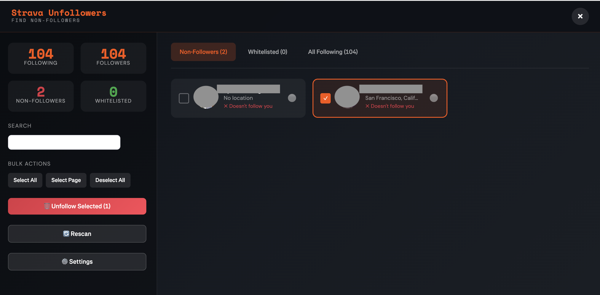

# 🏃 Strava Unfollowers

A lightweight, browser-based tool to find who doesn't follow you back on Strava. 
**No downloads, no installations, no passwords required.**

## ✨ Features
* **Safe & Secure:** Runs entirely in your browser. No data is sent to external servers.
* **Smart Scanning:** Compares your "Following" and "Followers" lists.
* **Mass Unfollow:** Select multiple users and unfollow them with one click.
* **Whitelist:** "Star" users to prevent accidental unfollowing.
* **Rate Limit Protection:** Built-in delays to prevent Strava from flagging your account.

## 🚀 How to Use

**[👉 Click here to go to the Installation Page](https://bardmyway.github.io/strava-unfollowers/bookmarklet.html)**

### Method 1: The Bookmarklet (Easiest)
1.  Go to the [Installation Page](https://bardmyway.github.io/strava-unfollowers/bookmarklet.html).
2.  Drag the **"🏃 Strava Unfollowers"** button to your bookmarks bar.
3.  Go to [Strava.com](https://www.strava.com).
4.  Click the bookmark!

### Method 2: Manual Console (Developer Style)
1.  Go to the [Installation Page](https://bardmyway.github.io/strava-unfollowers/bookmarklet.html).
2.  Click the **"📋 Copy Script Code"** button.
    * *Trust Check: You can [view the raw source code here](https://raw.githubusercontent.com/bardmyway/strava-unfollowers/main/strava-unfollowers.js) to verify it is safe.*
3.  Log in to [Strava.com](https://www.strava.com).
4.  Open Developer Tools (`Cmd+Option+J` on Mac or `Ctrl+Shift+J` on Windows).
5.  Paste into the Console and hit **Enter**.

## ⚙️ How it Works
Since Strava does not provide a public API for follower management, this tool works by automating the browser's native requests.
* **Scanning:** It fetches your lists page-by-page.
* **Unfollowing:** It identifies the specific relationship ID required by Strava's internal API to safely remove a connection.

## ⚠️ Disclaimer
**This tool is not affiliated, associated, authorized, endorsed by, or officially connected with Strava Inc.**

Use it responsibly. The tool includes safety delays (sleep timers) to respect Strava's server limits. Do not modify the delays to be faster unless you know what you are doing.

## 📄 License
**Copyright © 2025 bardmyway. All Rights Reserved.**

This project is provided for personal use only. Redistribution, commercial use, or modification without permission is prohibited.
