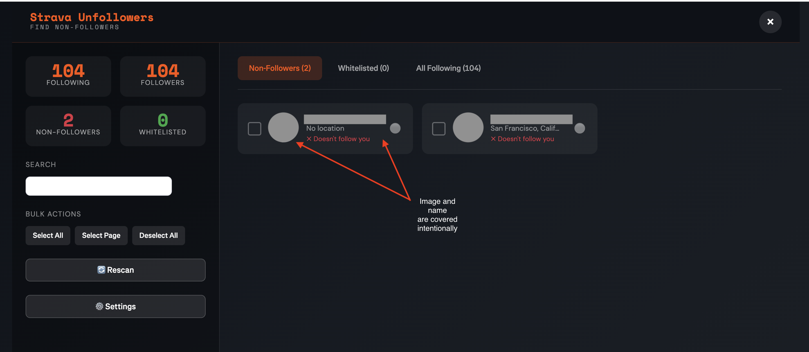
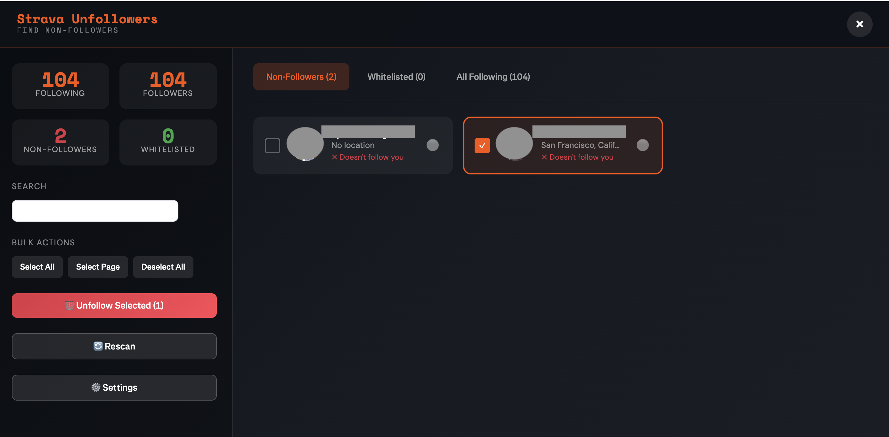

# 🏃 Strava Unfollowers

**See who doesn't follow you back on Strava — and who follows you that you don't follow back.**

* ✅ **Nothing to download or install** — it runs right inside your browser.
* ✅ **Never asks for your password** — you just log in to Strava like you always do.
* ✅ **Everything happens in your own browser** — your data never leaves your computer.

## 🚀 Get Started

### **[👉 CLICK HERE TO GET STARTED — it takes about one minute](https://bardmyway.github.io/strava-unfollowers/bookmarklet.html)**

That link takes you to a simple install page. Pick one of the two methods on it (both are explained step by step below).

## 🖥️ What You'll Need

* **A computer** (Windows or Mac) running Chrome, Edge, Firefox or Safari.
* **Your Strava login** — just to sign in to Strava normally, the way you always do.
* ⚠️ **It does not work on phones or tablets.** Computers only.

## ✨ What It Does

* 🔍 **Scans your lists** — compares everyone you follow against everyone who follows you.
* 🗑️ **"Non-Followers" list** — see exactly who isn't following you back, select as many as you like, and unfollow them all in one go.
* 💙 **NEW: "Fans" tab** — see the people who follow *you* that you don't follow back, with one-click links to their profiles so you can check them out (and follow them back if you want).
* 🛡️ **Whitelist** — shield the people you want to keep no matter what, so you never unfollow them by accident.
* 🛡️ **Built-in safety delays** — the tool deliberately pauses between actions so Strava doesn't flag your account.
* 🔎 **Search and filters** — find anyone by name or location, and flip between tabs to see different groups.

## 📌 Setup Method 1: The Bookmark Button (Recommended)

A "bookmark" is just a saved button in your browser. You'll add one special bookmark, and clicking it opens the tool. Here's how:

1. **Show your bookmarks bar.** The bookmarks bar is the strip of saved links just under the address bar at the top of your browser. If you can't see it, press **Cmd+Shift+B** (Mac) or **Ctrl+Shift+B** (Windows) to make it appear.
2. **Open the [install page](https://bardmyway.github.io/strava-unfollowers/bookmarklet.html)** and **drag the orange "🏃 Strava Unfollowers" button** up onto your bookmarks bar. (Click and hold the button, move it up to the bar, let go.)
3. **Go to [strava.com](https://www.strava.com)** and log in like you normally do.
4. **Click your new "🏃 Strava Unfollowers" bookmark.** The tool opens right on top of the Strava page.

Then click **Start Scan** and wait — it can take a few minutes if you follow many people. That's normal.

## 📝 Setup Method 2: Copy & Paste

No bookmark needed — you paste the tool in by hand each time.

1. **Open the [install page](https://bardmyway.github.io/strava-unfollowers/bookmarklet.html)** and click the **"📋 Copy the code"** button. The code is now copied, ready to paste.
2. **Go to [strava.com](https://www.strava.com)** and log in.
3. **Open the console.** The console is a small window built into every browser where you can type commands. Press **F12**, or **Cmd+Option+J** (Mac) or **Ctrl+Shift+J** (Windows).
4. **Click inside the console, paste** (Cmd+V on Mac, Ctrl+V on Windows), and press **Enter**. The tool opens immediately.

> 💡 **If Chrome blocks your paste:** Chrome sometimes shows a warning the first time. Just type `allow pasting` into the console, press **Enter**, then paste again. That's it.

> 🍎 **Using Safari?** The console is hidden by default in Safari — just use Method 1 (the bookmark button) instead.

## 🎯 Using the Tool

1. Click **🚀 Start Scan**. The tool reads through your Following and Followers lists — keep the tab open and let it finish.
2. When the scan is done, you'll see your results organized into tabs:
   * **Non-Followers** — the people you follow who don't follow you back. This is the unfollow list.
   * **Fans** — people who follow you that you don't follow back. This list is view-only (you can't unfollow someone you don't follow!) — click anyone to visit their profile.
   * **Whitelisted** — your protected people. They never show up in the unfollow list.
   * **All Following** — everyone you follow, with a clear "follows you / doesn't follow you" label on each person.
3. **To unfollow:** click people to select them (or use **Select All** / **Select Page**), then click **🗑️ Unfollow Selected**. You'll be asked to confirm first.
4. **To protect someone:** click the small circle ⚪ on their card — it turns into a shield 🛡️, meaning they're whitelisted and safe from unfollowing.
5. **Search** by name or location any time using the search box on the left.

> ⚠️ **Leave the delay settings alone.** The tool pauses between unfollows on purpose, with a longer rest every fifth one. Those pauses are what keep Strava from flagging your account. Making them faster is not worth the risk.

## 🆘 Troubleshooting

**I click the bookmark and nothing happens.**
Make sure you're on **www.strava.com** and logged in — the tool only works there. Refresh the page and click the bookmark again. **If you installed the bookmark before this update, delete it and drag the new button from the [install page](https://bardmyway.github.io/strava-unfollowers/bookmarklet.html) again — the old one pointed at a broken address.**

**It says it can't find my athlete ID.**
Open your own profile page on Strava first (click your photo in the top-right corner, then "My Profile"), then click the bookmark again.

**The scan is really slow.**
That's on purpose. The pauses are safety delays that protect your account. Keep the tab open and let it finish.

**Can I use my phone?**
No — computers only. Phone browsers don't support bookmark buttons or consoles.

## ⚙️ How It Works (and Why It's Safe)

The tool simply reads the same Following and Followers pages you can already see on Strava yourself, one page at a time, with deliberate pauses in between. Nothing is sent anywhere — no servers, no tracking, no data collection; everything stays in your browser on your computer. It never sees or asks for your password. And the full code is public, so anyone can inspect exactly what it does: browse the [GitHub project](https://github.com/bardmyway/strava-unfollowers) or [read the source code directly](https://raw.githubusercontent.com/bardmyway/strava-unfollowers/main/strava-unfollowers.js).

## ⚠️ Disclaimer

This tool is not affiliated, associated, authorized, endorsed by, or officially connected with Strava Inc. Use it responsibly and at your own discretion.

## 📄 License

**© 2025–2026 Sapphire Apps LLC. All Rights Reserved.**

This project is provided for personal use only. Redistribution, commercial use, or modification without permission is prohibited.
